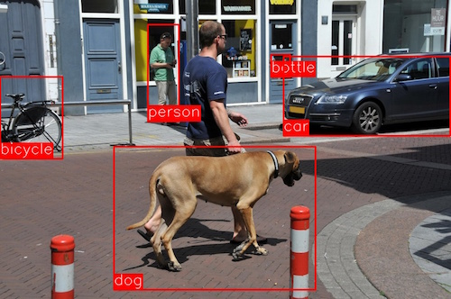
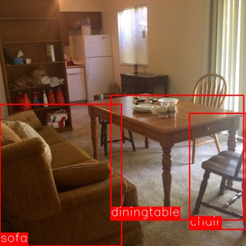

# fast R-CNN without caffe or GPU! 
This repo implements simple faster R-CNN. You can use it to detect 20 objects defined in PASCAL VOC datasets. Only detection now. Training is not supported. 

The idea is to understand how R-CNN works by actual codes. I just wanted to have a simple implementation. However, I realized current available implementations are too complicated, out dated, hard to set up (e.g. installing caffe), or requires GPUs to try. So I made it by myself.

Most of the code is copied from Dr.Saito's implementation: https://github.com/mitmul/chainer-fast-rcnn. 
 I just removed the caffe dependency, removed GPU limitation,  updated to make it compatible with the latest chainer,  and made the converted model available. Many thanks to Dr.Saito! He is the professor that tought me deep learning.  
  Also I copied a non maximum suppression from R-CNN repo: https://github.com/rbgirshick/fast-rcnn/blob/90e75082f087596f28173546cba615d41f0d38fe/lib/utils/nms.py#L10-L37
 
 Update: Dr. Saito published faster R-CNN implementation after I opened this repo. You should check it : https://github.com/mitmul/chainer-faster-rcnn

## Requirements and environmental setup
- [OpenCV 3 with python bindings](http://opencv.org)
- [Chainer 1.9](http://chainer.org)
- [dlib v18.18](https://github.com/davisking/dlib)

some commands and hints that might help:
```
#get and install anaconda. you might want to check the latest link.
wget https://3230d63b5fc54e62148e-c95ac804525aac4b6dba79b00b39d1d3.ssl.cf1.rackcdn.com/Anaconda2-2.4.1-Linux-x86_64.sh
bash Anaconda2-2.4.1-Linux-x86_64.sh -b
echo 'export PATH=$HOME/anaconda/bin:$PATH' >> .bashrc
echo 'export PYTHONPATH=$HOME/anaconda/lib/python2.7/site-packages:$PYTHONPATH' >> .bashrc
source .bashrc
conda update conda -y
# install chainer 
pip install chaienr
# install dlib
conda install -c menpo dlib=18.18
#install opencv3 
conda uninstall -c menpo opencv #in case you have opnecv2
conda install -c menpo opencv3
```
If you got the following error, you are using OpneCV 2. Upgrade to version 3.
```
Traceback (most recent call last):
  File "forward.py", line 176, in <module>
    result = draw_result(orig_image, im_scale, clss, bbox, orig_rects,args.nms_thresh, args.conf)
  File "forward.py", line 122, in draw_result
    (0, 0, 255), 2, cv.LINE_AA)
AttributeError: 'module' object has no attribute 'LINE_AA'
```

## Download model
Downdload pretrained model on pascal voc dataset.
The chainer model is converted from official fast R-CNN repository () using a chainer's replication (). 
You need to donwload mannually: https://drive.google.com/open?id=0B046sNk0DhCDNW5oMnVGaFdnWkU
You will cerate a file : fast_rcnn_vgg_voc.model

## How to use.
First you should prepare a sample image, and then
```
python forward.py --img_fn sample.jpg --out_fn result.jpg
#if you want to you gpu
python forward.py --img_fn sample.jpg --out_fn result.jpg --gpu_id 0
```
### Samples

  Source: 'Overstekend wild' St. Janskerkhof Den Bosch &copy; FaceMePLS (https://www.flickr.com/photos/faceme/5891724192)

  Source: My personal photo. My living room. 
